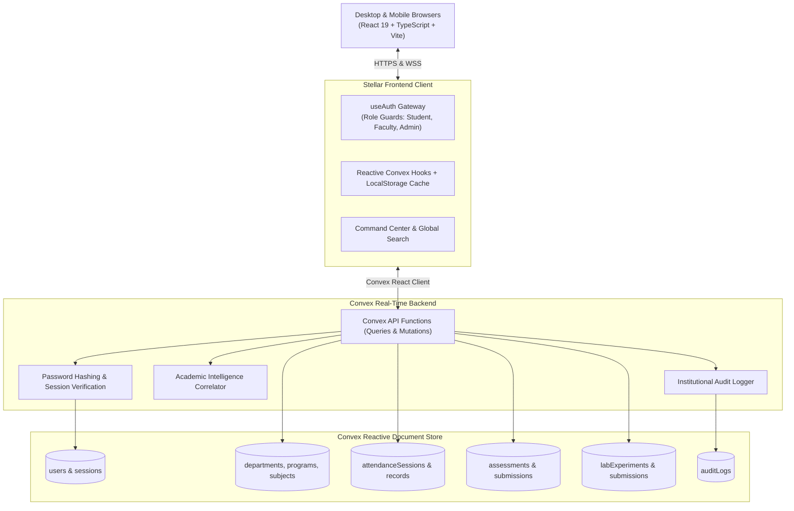

# 🌟 Stellar — Academic Intelligence Platform

<div align="center">


### Unified Operating System for Modern Academia
**Intelligent Attendance Buffers • Assessment Management • Lab Records • Proactive AI Insights • Multi-Role Dashboards**

[](https://stellar-five-sable.vercel.app)
[](https://github.com/SRX3969/Stellar)

[](https://react.dev/)
[](https://www.typescriptlang.org/)
[](https://vitejs.dev/)
[](https://www.convex.dev/)
[](LICENSE)

---

### 🔗 **Live Production URL:** [https://stellar-five-sable.vercel.app](https://stellar-five-sable.vercel.app)
</div>

---

## 📖 Table of Contents

- [Overview](#-overview)
- [Live Demo & Test Credentials](#-live-demo--test-credentials)
- [Key Features by Role](#-key-features-by-role)
  - [🎓 Student Academic Portal](#-student-academic-portal)
  - [🧑‍🏫 Faculty & Teacher Portal](#-faculty--teacher-portal)
  - [🏛️ Institutional Admin Portal](#️-institutional-admin-portal)
- [System Architecture](#-system-architecture)
- [Data Model & Schema](#-data-model--schema)
- [Keyboard Shortcuts](#-keyboard-shortcuts)
- [Tech Stack](#-tech-stack)
- [Getting Started Locally](#-getting-started-locally)
- [Environment Variables](#-environment-variables)
- [Deployment](#-deployment)
- [Authors & Acknowledgments](#-authors--acknowledgments)

---

## 🔭 Overview

**Stellar** is an enterprise-grade Academic Intelligence Platform built to bridge the gap between fragmented institutional management tools and daily student workflows. Designed with a sleek, modern glassmorphic interface and powered by a real-time reactive backend, Stellar provides unified operations across faculty grading, student attendance tracking with mathematical projection buffers, lab record evaluations, and early-warning AI analytics.

### Why Stellar?
- 🚫 **No more attendance guessing**: Built-in 75% criterion buffer calculates the exact number of classes you can safely skip or need to attend to recover.
- ⚡ **Zero-latency reactive data**: Powered by **Convex**, data syncs instantly between faculty attendance marking and student dashboards over WebSockets.
- 🧠 **Proactive academic intelligence**: Correlates attendance drops, quiz marks, and missing lab submissions to flag at-risk students before exams.
- 🎯 **All-in-one ecosystem**: Eliminates the need for 5 separate apps for timetables, tasks, notes, attendance, and CIA assessments.

---

## 🚀 Live Demo & Test Credentials

The application is deployed and publicly accessible on Vercel:

> 🌐 **Live Website**: [https://stellar-five-sable.vercel.app](https://stellar-five-sable.vercel.app)

You can explore the platform immediately using the pre-seeded institutional accounts below or create a new student account via the `/signup` gateway:

| Role | Username | Password | Default Portal Route | Permissions / Access |
| :--- | :--- | :--- | :--- | :--- |
| 🎓 **Student** | `stellar_student` | `St3llar!Stud2026` | `/student/dashboard` | Attendance buffers, timetable, tasks, study timer, AI tutor, documents |
| 🧑‍🏫 **Teacher** | `stellar_teacher` | `St3llar!Teach2026` | `/teacher/dashboard` | Class rosters, attendance marking, assessment grading, lab evaluations, AI insights |
| 🏛️ **Admin** | `stellar_admin` | `St3llar!Admin2026` | `/admin/dashboard` | Department & program setup, teacher & student directory, audit logs |

---

## ✨ Key Features by Role

### 🎓 Student Academic Portal
- **Smart Attendance Tracker with 75% Criterion Buffer**:
  - Live percentage computation against institutional requirements (75% default or custom).
  - Dynamic **"Safe Bunk" vs "Classes Needed"** projection calculator (`Can safely miss X classes` or `Must attend next Y classes to recover`).
  - Color-coded safety zones: `SAFE` (≥75%), `WATCH` (70–74%), `RISK` (63–69%), and `CRITICAL` (<63%).
- **Live Timetable & Ongoing Class Monitor**:
  - Real-time indicator displaying the ongoing lecture, remaining minutes countdown, classroom/lab venue, and professor name.
  - Interactive Day and Week timetable views with Batch B1/B2 filtering.
- **AI Tutor Assistant**:
  - Interactive conversational assistant customized to university coursework with concept breakdown, revision summaries, and sample quiz generation.
- **Pomodoro Focus Study Room**:
  - Integrated study session timer, ambient background audio soundscapes, daily study goals, and persistent study minute logging.
- **Daily Academic Habits & Routine Checklist**:
  - Daily routine checklist to keep students disciplined with academic and wellness habits.
- **Task & Assignment Manager**:
  - Kanban and list views, urgency levels (`Urgent`, `High`, `Normal`), subject tagging, and countdown deadlines.
- **Assessment & Grades Vault**:
  - Continuous Internal Assessment (CIA), quiz scores, mid-semester evaluations, and grade distribution tracking.
- **Document Vault**:
  - Centralized storage for course syllabus PDFs, lecture notes, lab sheets, and reference materials with instant search.
- **Command Center & Global Search**:
  - Keyboard-driven command palette (`Ctrl+K` / `Cmd+K`) and instantaneous search (`/`).

---

### 🧑‍🏫 Faculty & Teacher Portal
- **Live Attendance Manager**:
  - Interactive student roster grid with one-click toggles (`Present`, `Absent`, `Late`).
  - Batch filtering (`B1` / `B2`), quick bulk actions (`Mark All Present`), and real-time attendance calculation.
- **Assessment & Gradebook Hub**:
  - Create assessments across 5 types: *Assignment*, *Quiz*, *CIA Test*, *Mid-Term Exam*, *End-Term Exam*.
  - Grade submissions, input marks with automatic percentage computation, and view class score distributions.
- **Lab Record Manager**:
  - Track experiment completions, student code/report submissions, and viva evaluation scores across engineering labs.
- **Early-Warning AI Insights Engine**:
  - Transparent rule-based analysis correlating attendance records, assessment marks, and lab submissions.
  - Generates actionable interventions (e.g., *"Flagged for high absence risk & below 50% quiz score — schedule academic counselling"*).
- **Student Performance Viewer**:
  - Comprehensive drill-down into individual student statistics, overall attendance percentage, and assessment trajectory.

---

### 🏛️ Institutional Admin Portal
- **Institution Analytics**:
  - High-level KPIs across total student enrollment, active faculty, academic departments, and course offerings.
- **Department & Program Management**:
  - Configure academic departments (e.g., *Department of AI and Data Science Engineering*) and assign Heads of Department (HOD).
- **Teacher & Student Directory**:
  - Manage faculty roster, employee IDs, subject allotments, and student batch enrollments.
- **Subject & Course Mapping**:
  - Manage curriculum courses, course codes (`CS301`, `AI204`), credit hours, and syllabus allocations.
- **Institutional Audit Logs**:
  - Complete, immutable audit log recording administrative events, role changes, grade adjustments, and authentication events with timestamps and IP metadata.

---

## 🏗️ System Architecture



---

## 🗄️ Data Model & Schema

Stellar uses a typed, relational schema managed in [`convex/schema.ts`](file:///c:/Users/abhir/OneDrive/Desktop/SHYN%20Projects/Stellar/convex/schema.ts):

| Collection | Key Fields | Description |
| :--- | :--- | :--- |
| `users` | `username`, `email`, `role`, `batch`, `studentId`, `employeeId`, `criterion` | User profiles with role discriminator (`student` \| `teacher` \| `admin`) |
| `departments` | `name`, `code`, `hodName`, `isActive` | Academic departments |
| `programs` | `name`, `code`, `departmentId`, `durationYears` | Degree programs (e.g., B.Tech AI & DS) |
| `subjects` | `name`, `code`, `teacherId`, `credits`, `type` | Courses and syllabus metadata |
| `timetableSlots`| `subjectId`, `dayOfWeek`, `startTime`, `endTime`, `roomNo`, `batch` | Weekly recurring timetable schedule |
| `attendanceSessions` | `subjectId`, `teacherId`, `date`, `slotId`, `batch` | Individual lecture or lab attendance sessions |
| `attendanceRecords` | `sessionId`, `studentId`, `status` (`present` \| `absent` \| `late`) | Per-student session attendance |
| `assessments` | `subjectId`, `teacherId`, `title`, `type`, `maxMarks`, `dueDate` | Exams, assignments, quizzes, and CIA tests |
| `assessmentSubmissions` | `assessmentId`, `studentId`, `marksObtained`, `status` | Student grades and feedback |
| `labExperiments`| `subjectId`, `experimentNo`, `title`, `maxMarks` | Laboratory practical syllabus |
| `labSubmissions`| `experimentId`, `studentId`, `status`, `marksObtained` | Practical evaluations and viva marks |
| `tasks` | `userId`, `title`, `deadline`, `priority`, `completed` | Personal student task and assignment reminders |
| `auditLogs` | `userId`, `action`, `entityType`, `details`, `timestamp` | Security and institutional audit trail |

---

## ⌨️ Keyboard Shortcuts

Speed up your navigation across the platform using global hotkeys:

| Shortcut | Action | Description |
| :--- | :--- | :--- |
| `Ctrl + K` / `Cmd + K` | **Command Center** | Opens the Raycast-style command launcher for quick navigation and actions |
| `/` | **Global Search** | Focuses instantaneous search modal across subjects, notes, and tasks |
| `Esc` | **Close Overlays** | Dismisses any active modal, briefing, or search palette |

---

## 🛠️ Tech Stack

- **Frontend Core**: [React 19](https://react.dev/), [TypeScript 6](https://www.typescriptlang.org/), [Vite 8](https://vitejs.dev/)
- **Routing**: [React Router 7](https://reactrouter.com/) (Data router with protected role guards)
- **Styling**: Vanilla CSS design tokens with sleek HSL color palettes, responsive layouts, and glassmorphic elevations
- **Animations**: [Motion 13](https://motion.dev/) (Framer Motion v13)
- **Icons**: [Lucide React](https://lucide.dev/)
- **Backend & Database**: [Convex](https://www.convex.dev/) (TypeScript server functions with real-time WebSocket replication)
- **Deployment**: [Vercel](https://vercel.com/) with single-page app rewrite configuration

---

## 💻 Getting Started Locally

### Prerequisites
- [Node.js](https://nodejs.org/) (version `18.x` or higher recommended)
- [npm](https://www.npmjs.com/) or [pnpm](https://pnpm.io/)
- A free [Convex](https://www.convex.dev/) account

### 1. Clone the Repository
```bash
git clone https://github.com/SRX3969/Stellar.git
cd Stellar
```

### 2. Install Dependencies
```bash
npm install
```

### 3. Setup Environment Variables
Create a `.env.local` file in the root directory:
```env
# Convex Deployment Credentials
VITE_CONVEX_URL="https://your-convex-deployment.convex.cloud"
CONVEX_DEPLOYMENT="dev:your-deployment-name"
```

### 4. Run the Backend & Frontend Dev Servers
In your first terminal, start the Convex cloud synchronization:
```bash
npx convex dev
```

In your second terminal, launch the Vite local development server:
```bash
npm run dev
```

Open your browser and navigate to **`http://localhost:5173`**.

---

## 🧪 Build & Verification

To run linter checks and create a production build:

```bash
# Check code style with Oxlint
npm run lint

# Compile TypeScript and build production bundle
npm run build

# Preview the production build locally
npm run preview
```

---

## 🌐 Deployment

### Deploying to Vercel
Stellar includes a pre-configured [`vercel.json`](file:///c:/Users/abhir/OneDrive/Desktop/SHYN%20Projects/Stellar/vercel.json) for client-side routing rewrites:

```json
{
  "rewrites": [
    {
      "source": "/(.*)",
      "destination": "/index.html"
    }
  ]
}
```

1. Push your repository to GitHub (`https://github.com/SRX3969/Stellar`).
2. Import the repository into your [Vercel Dashboard](https://vercel.com/).
3. Add `VITE_CONVEX_URL` into **Settings > Environment Variables**.
4. Deploy! Vercel will automatically run `npm run build` and output the static assets from `dist/`.

---

## 👥 Authors & Acknowledgments

- **Lead Developer**: [Shreeram Prakasan (SRX3969)](https://github.com/SRX3969)
- **Project Repository**: [SRX3969/Stellar](https://github.com/SRX3969/Stellar)
- **Live Deployment**: [https://stellar-five-sable.vercel.app](https://stellar-five-sable.vercel.app)

---

<div align="center">
  <sub>Built with ❤️ for educational institutions, faculty, and students.</sub>
</div>
